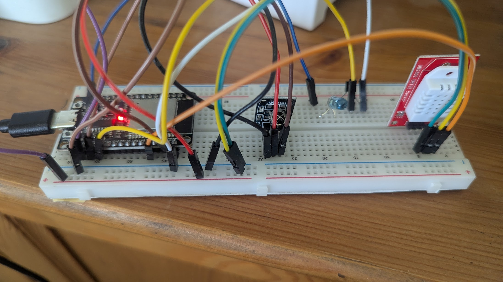

# tadiran-carrier-IR-esp32
An ESP32 based project to control Tadiran-Carrier central HVAC unit via IR and esphome / Home Assistant

## List of components required to build
* ESP32-Wroom or compatible
* DHT-22 Temperature and Humidity sensor : https://www.aliexpress.com/item/32759901711.html
* TSAL6400 IR Led : https://www.aliexpress.com/item/1005003913209026.html
* 2N3904 NPN Transistor : https://www.aliexpress.com/item/1005007118584585.html
* KY-022 Infrared Sensor Receiver : https://www.aliexpress.com/item/1005006194367750.html

## Build

Ground and 3.3V to DHT22 and KY022 are trivial.
* GPIO pins in my build are :
* GPIO23 for KY-022 IR reciever reading (brown lead)
* GPIO15 for IR trasmitting (middle leg of the transistor, yellow lead)
* GPIO21 for DHT22 temp and humidity reading (orange lead)
* Right leg of the transistor is GND
* I got better results without a resistor, but hey - I might be wrong here...

### Caveats
* The TSAL6400 IR led is rated for 5V, therefore the board is powered by USB and 5V is taken via the blue lead from VIN on the ESP32 to the left leg of the transistor (blue lead)
* Flash esphome to the ESP32, and use the ac-control.yaml to control your AC from the frontend
* I am still looking for a way to integrate the raw IR buttons and switches to the native esphome terhmostate or climate component.
  

